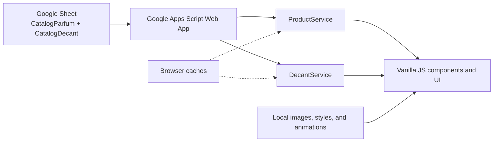

# digital-catalog

[](LICENSE)

**digital-catalog** is an open-source fragrance catalog built with static HTML,
CSS, and vanilla JavaScript. It renders product and decant views in the browser,
without a framework, build step, or package manager.

**Live site:** <https://montesgp.github.io/digital-catalog/>

## Quick start

The app uses ES modules and browser `fetch`, so serve it over HTTP rather than
opening `index.html` with `file://`.

```bash
python -m http.server 8080
```

Open <http://127.0.0.1:8080/> and run the offline quality gate before sharing a
change:

```bash
node scripts/check-structure.mjs
```

## Scan to open the catalog

<a href="https://montesgp.github.io/digital-catalog/">
  
</a>

The versioned QR asset encodes the live URL above and can be scanned by a mobile
phone camera.

## How it works



See [the architecture guide](docs/ARCHITECTURE.md) and the editable
[draw.io diagram](docs/digital-catalog-architecture-diagram.drawio).

## Operational data boundary

The current configuration retains a Google Apps Script endpoint that serves two
active Sheets: `CatalogParfum` and `CatalogDecant`. Those Sheets are operational
data sources, not open-source fixtures. CI and local quality gates **never call
the endpoint** and contributors must not commit exports, live rows, credentials,
or personal data. The MIT license covers this repository's code and documentation;
it does not grant rights to external trademarks or operational data.

## Project structure

```text
components/  Product, detail, and decant UI components
config/      Site metadata and Apps Script integration configuration
services/    ProductService, DecantService, filtering, loading, and UI helpers
products/    Local catalog image assets and fallback content
styles/      Site styles
scripts/     Offline structural quality gate
docs/        Architecture and QR assets
```

## Deployment

GitHub Actions validates pushes and pull requests without accessing operational
data. The Pages deployment workflow runs only from `main` and uses the official
GitHub Pages artifact deployment actions. Its target is
<https://montesgp.github.io/digital-catalog/>.

Repository owners must set **Settings → Pages → Source** to **GitHub Actions**
before the first deployment.

## Contributing and governance

- [Contributing guide](CONTRIBUTING.md)
- [Code of Conduct](CODE_OF_CONDUCT.md)
- [Security policy](SECURITY.md)
- [Issue templates](.github/ISSUE_TEMPLATE)
- [MIT License](LICENSE)

`dev` is the development integration branch; `main` is the protected production
branch. Please read the contribution guide before opening an issue or pull
request.
