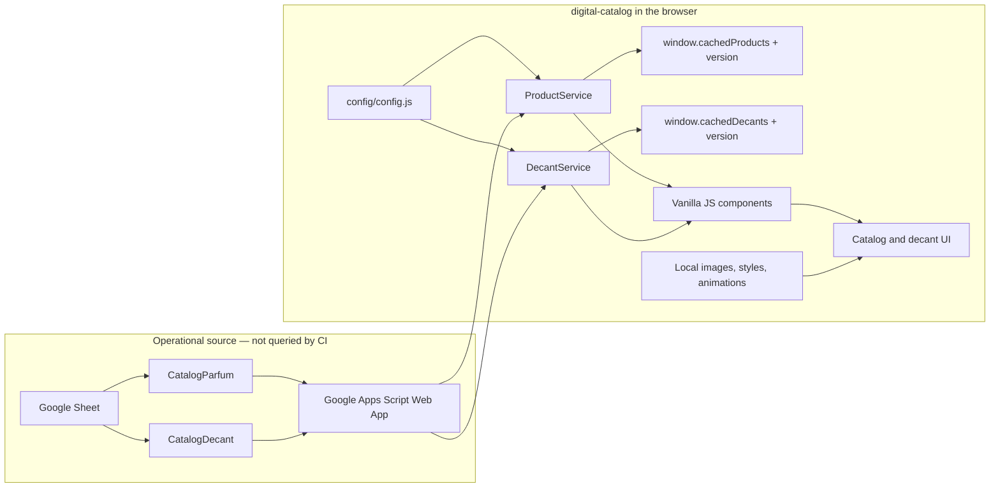

# digital-catalog architecture

`digital-catalog` is a browser-only, static vanilla JavaScript catalog. Its
runtime data boundary is explicit: a Google Apps Script Web App reads two active
Google Sheet tabs and the browser renders their responses. No server, database,
or build pipeline belongs to this repository.

## Runtime flow

## Responsibilities

| Layer | Responsibility | Boundary |
| --- | --- | --- |
| Google Sheet | Holds active catalog rows in `CatalogParfum` and `CatalogDecant`. | Operational data; not copied to this repository. |
| Google Apps Script | Publishes Sheet responses for the browser. | Endpoint stays configured, but CI never invokes it. |
| `config/config.js` | Holds the Pages URL, preview image URL, endpoint reference, and tab names. | Keep the endpoint and Sheet names intact unless an authorized integration change requires it. |
| `ProductService` | Requests the perfume collection, applies its display mapping, and caches by returned version. | Uses `window.cachedProducts` and `window.cachedProductsVersion`. |
| `DecantService` | Requests the decant collection, maps volume/notes, and caches by returned version. | Uses `window.cachedDecants` and `window.cachedDecantsVersion`. |
| Components and UI | Render cards, detail modal, filters, tabs, and decant table. | Vanilla JavaScript modules; no framework runtime. |
| Local assets | Supply product images, styles, loader animation, and fallback resources. | Served statically with the site. |

## Caching and failure behavior

Both services append a timestamp query parameter while requesting the Apps Script
endpoint and reuse in-memory browser data when the response version is unchanged.
A failed request resolves to an empty collection; the UI surfaces its catalog
error state. The cache is per page session and is not a server-side cache.

## Delivery architecture

- Pull request and push quality gates run `scripts/check-structure.mjs` only.
- The validator reads repository files and configuration text; it makes no network
  request and cannot read operational Sheet rows.
- `main` triggers the GitHub Pages workflow, which packages the static repository
  artifact and deploys it to the personal Pages site.

## Editable diagram

Open [digital-catalog-architecture-diagram.drawio](digital-catalog-architecture-diagram.drawio)
in diagrams.net to update the companion diagram. Keep its labels scoped to
`digital-catalog`; it must not identify a different product or organization.
